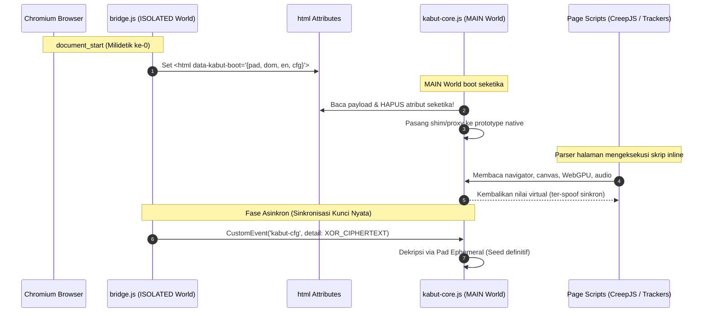

# Kabut Stealth — Advanced Anti-Fingerprinting & Hardware Privacy Shield

[](https://developer.chrome.com/docs/extensions/mv3/intro/)
[](CHANGELOG.md)
[](docs/UJI.md)
[](docs/UJI.md)
[-success.svg)](#keamanan--privasi-tanpa-kompromi)
[](LICENSE)

> **"Fingerprinters see fog, not your hardware."**  
> *Kabut* adalah ekstensi peramban berbasis Chromium (Manifest V3) mutakhir yang dirancang khusus untuk memproteksi identitas perangkat keras (*hardware fingerprint*) dari skrip pelacakan invasif tanpa merusak fungsionalitas dan kompatibilitas aplikasi web modern.

---

## Daftar Isi

1. [Ringkasan Eksekutif](#ringkasan-eksekutif)
2. [Prinsip Desain & Filosofi](#prinsip-desain--filosofi)
3. [Arsitektur Teknis v3.0.0](#arsitektur-teknis-v300)
   - [Boot Sinkron 0-Milidetik (DOM Pre-Arming)](#1-boot-sinkron-0-milidetik-dom-pre-arming)
   - [Kanal IPC Terenkripsi Ephemeral](#2-kanal-ipc-terenkripsi-ephemeral)
   - [PRNG Deterministik Per-Domain Terisolasi](#3-prng-deterministik-per-domain-terisolasi)
   - [Engine makeBoundProxy](#4-engine-makeboundproxy-kesetiaan-prototipe)
4. [Matriks Permukaan Proteksi](#matriks-permukaan-proteksi)
5. [Anti-Tampering & Lie-Detector Mitigation](#anti-tampering--lie-detector-mitigation)
6. [Declarative Net Request (DNR) & Client Hints](#declarative-net-request-dnr--client-hints)
7. [Hasil Pengujian & Verifikasi (349 Unit + 226 E2E)](#hasil-pengujian--verifikasi-349-unit--226-e2e)
8. [Panduan Instalasi & Penggunaan](#panduan-instalasi--penggunaan)
9. [Batasan Teknis yang Jujur (Honest Boundaries)](#batasan-teknis-yang-jujur-honest-boundaries)
10. [Struktur Repositori](#struktur-repositori)
11. [Keamanan & Privasi Tanpa Kompromi](#keamanan--privasi-tanpa-kompromi)
12. [Lisensi](#lisensi)

---

## Ringkasan Eksekutif

Skrip *browser fingerprinting* generasi terbaru (seperti CreepJS, FingerprintJS Pro, dan pelacak telemetri komersial) tidak lagi hanya menginspeksi `navigator.userAgent`. Mereka mengekstraksi ratusan sinyal laten beresolusi tinggi:
- Keunikan rasterisasi grafis sub-piksel (**Canvas 2D** & **WebGL**).
- Arsitektur komputasi modern tingkat rendah (**WebGPU limits & adapter info**).
- Karakteristik konversi digital-analog dan latensi tumpukan audio (**AudioContext**).
- Eksekusi paralel di luar thread utama (**Web Worker blob scope**).
- Kebocoran topologi antarmuka jaringan lokal (**WebRTC SDP candidate reflection**).
- Enumerasi bus perangkat keras eksternal (**Web Bluetooth, WebUSB, WebHID, Web Serial**).
- Header HTTP asimetris resolusi tinggi (**Client Hints / `Accept-CH`**).

**Kabut v3.0.0** menerapkan pendekatan rekayasa komprehensif dari hulu ke hilir untuk memutus korelasi lintas-situs (*cross-site tracking*). Setiap domain web disajikan profil perangkat virtual yang stabil, realistis, dan matematis konsisten, namun sama sekali berbeda dari profil yang diterima domain lainnya.

---

## Prinsip Desain & Filosofi

### 1. Determinisme Per-Domain (Bukan Acak Liar)
Mayoritas ekstensi privasi primitif menyuntikkan noise acak murni pada setiap pemanggilan API (misal `Math.random()` pada setiap frame canvas). Pendekatan tersebut **merusak fungsionalitas aplikasi web** (seperti game, editor foto web, peta interaktif, dan validasi formulir) dan **sangat mudah dideteksi** oleh mekanisme *double-render test*.

Kabut menggunakan PRNG deterministik terindeks:
- **Seed per-domain**: Diturunkan secara kriptografis dari rahasia master instalasi dan nama host.
- **Noise matematis murni**: Merupakan fungsi murni dari koordinat piksel dan channel warna.
- **Domain yang sama** selalu melihat keluaran yang persis sama di setiap render ulang (stabilitas intra-domain 100%).
- **Domain yang berbeda** melihat nilai yang tidak berkorelasi (korelasi lintas-domain terputus total).

### 2. Zero-Lie Local Identity (Tanpa Pemalsuan Ceroboh)
Kabut **TIDAK memalsukan** zona waktu sistem (`Intl.DateTimeFormat`), tumpukan bahasa (`navigator.languages`), ataupun media query CSS seperti `prefers-color-scheme`. 

Pelacak modern membandingkan perbedaan antara API JavaScript, layer CSS native, dan header TCP/IP/HTTP (`Accept-Language`). Setiap ketidaksesuaian kecil langsung memicu bendera *Lie Detector* (misal: JS mengaku London UTC+0, tetapi jeda rendering canvas mencerminkan font rendering Windows bahasa Indonesia). Kabut mempertahankan identitas lokal autentik sambil mengaburkan entropi perangkat keras.

### 3. Nilai Aman & Konsisten (Zero Breakage)
Saat memproteksi API mutakhir seperti **WebGPU**, Kabut tidak memalsukan nilai di luar kapabilitas perangkat fisik. `limits` dipin ke **batas minimum spesifikasi standar**, dan `features` hanya difilter (tidak pernah ditambah). Web app tidak akan pernah meminta instruksi perangkat keras yang gagal dieksekusi oleh kartu grafis fisik Anda.

---

## Arsitektur Teknis v3.0.0



### 1. Boot Sinkron 0-Milidetik (DOM Pre-Arming)
Pada Manifest V3, script content yang membutuhkan akses ke storage ekstensi bersifat asinkron (`chrome.storage.local.get`). Jika sebuah ekstensi menunggu respons asinkron sebelum mem-patch halaman, skrip inline di dalam `<head>` halaman web dapat mencuri nilai asli sebelum patch terpasang (*race condition*).

Kabut menyelesaikan tantangan ini dengan sistem **DOM Pre-Arming**:
1. `bridge.js` berjalan di isolated world pada fase `document_start`.
2. Bridge membaca cache konfigurasi tersanitasi dari `sessionStorage` lalu menuliskan atribut sementara `data-kabut-boot` pada tag `<html>`.
3. `kabut-core.js` (berjalan di world `MAIN`) langsung mengekstrak atribut tersebut, **seketika menghapus atribut dari DOM**, dan langsung memasang seluruh patch sebelum parser HTML membaca baris skrip pertama.
4. Skrip pelacak halaman tidak pernah sempat membaca nilai native maupun mendeteksi keberadaan atribut boot.

### 2. Kanal IPC Terenkripsi Ephemeral
Pada arsitektur ekstensi konvensional (termasuk Kabut v2.x lama), pertukaran pesan antar-world dilakukan via `CustomEvent` teks polos. Hal ini menciptakan kerentanan kritis di mana skrip halaman dapat memasang *event listener* siluman untuk mencuri master seed dan daftar allowlist pengguna.

Pada **Kabut v3.0.0**:
- Seed dan data sensitif ditransfer menggunakan enkripsi simetris **One-Time Pad (XOR)** dengan pad acak 1024-byte per-load.
- Kunci pad dihantarkan eksklusif pada fase boot sinkron dan langsung dihapus dari memori DOM.
- Daftar situs terpercaya (*allowlist*) **tidak pernah dikirim ke world MAIN**; evaluasi izin sepenuhnya diselesaikan di world isolated oleh `bridge.js`.
- Skrip halaman yang mencoba menyadap `CustomEvent('kabut-cfg')` hanya akan menerima rentetan ciphertext acak yang tidak dapat didekripsi.

### 3. PRNG Deterministik Per-Domain Terisolasi
Mesin pengacak Kabut dibangun di atas kombinasi algoritma **xmur3** (penghasil state 32-bit dari string) dan **sfc32** (Small Fast Chaotic PRNG berkecepatan tinggi dengan periode $\approx 2^{128}$):
- Setiap domain memiliki state seed unik yang diturunkan dari master secret instalasi.
- Setiap modul memiliki sub-stream terisolasi (`kabut/canvas|...`, `kabut/webgl|...`, `kabut/audio|...`). Perubahan aktivitas pada modul canvas tidak akan menggeser determinisme pada modul audio.

### 4. Engine makeBoundProxy: Kesetiaan Prototipe
Banyak script detektor mendeteksi manipulasi fungsi dengan memeriksa `Function.prototype.toString`, `instanceof`, deskriptor properti, atau memicu *illegal invocation error* ketika method native dipanggil pada objek wrapper.

Kabut mengimplementasikan engine refleksi `makeBoundProxy`:
- Mengikat method native secara langsung ke instance platform nyata (*bound to native target*).
- Menjaga keaslian rantai prototipe (`Object.getPrototypeOf`).
- Menjaga hasil evaluasi `instanceof` (misal: `gl instanceof WebGLRenderingContext`, `adapter instanceof GPUAdapter`).
- Mengembalikan `[native code]` asli melalui registry internal `WeakMap`.

---

## Matriks Permukaan Proteksi

| Subsistem | Mekanisme Proteksi | Modus Operasional |
| :--- | :--- | :--- |
| **Canvas 2D & OffscreenCanvas** | Injeksi noise deterministik LSB (±1–5) pada `toDataURL`, `toBlob`, `getImageData`, `convertToBlob`. Fungsi murni matematis koordinat $(x, y, ch)$. **Piksel transparan (alpha=0) dilewati** untuk menggagalkan detektor blank-canvas probe. | Noise / Blokir / Off |
| **WebGPU (Baru v3.0)** | Spoofing `GPUAdapter.info` (vendor generik terdistribusi + `common-3d`). `limits` dipin ke spesifikasi minimum standar. `features` difilter ketat ke subset desktop umum. Dibungkus via `makeBoundProxy` tanpa *illegal invocation*. | Aktif / Nonaktif |
| **Blob Web Worker (Baru v3.0)** | Intersepsi `URL.createObjectURL` & konstruktor `Worker`/`SharedWorker`. Menyuntikkan prelude terpadu ke dalam scope worker: mem-patch `hardwareConcurrency`, `userAgent`, dan `OffscreenCanvas` dengan **tabel seed identik thread utama**. | Aktif / Nonaktif |
| **Hardware & Periferal (Baru v3.0)** | Web Bluetooth, WebUSB, WebHID, Web Serial: `getDevices()` $\to$ `[]`, `requestDevice()` $\to$ `NotFoundError` natural. WebXR dinonaktifkan (`isSessionSupported` $\to$ false). `getGamepads()` $\to$ `[null×4]`. Sensor gerak ditolak. | Aktif / Nonaktif |
| **WebGL & WebGL2** | Spoofing `UNMASKED_VENDOR_WEBGL` & `UNMASKED_RENDERER_WEBGL` sesuai profil sistem operasi. Nilai `MAX_TEXTURE_SIZE` & `VIEWPORT` dinormalisasi. Farbling deterministik pada `getSupportedExtensions` & `getExtension`. | Aktif / Nonaktif |
| **AudioContext** | Injeksi noise mikro (±1e-7) pada `AudioBuffer` dan `AnalyserNode`. Re-noise pada `copyToChannel`. **Sampel hening (0 / 128) dilewati**. Mengunci `baseLatency` & `outputLatency` untuk mencegah *acoustic hardware profiling*. | Aktif / Nonaktif |
| **Navigator & Architecture** | Sanitasi `hardwareConcurrency` (pool 4/8/16/20), `deviceMemory` (pool 4/8/16 GB), `maxTouchPoints = 0`, `webdriver = false`, emulasi 64 tombol layout US keyboard fisik, pembersihan baterai & status koneksi jaringan. | Granular |
| **Screen & Window Geometry** | Dimensi layar dipin ke pool realistis ($\ge$ ukuran fisik). Normalisasi DPR. Nilai `outerWidth`/`outerHeight` dihitung dinamis untuk mengaburkan ukuran monitor nyata saat jendela di-maksimalkan. | Aktif / Nonaktif |
| **Permissions API** | Resolusi deterministik per-domain. Proteksi khusus: permission `local-fonts` dan `notifications` tidak pernah mengembalikan 'granted' tanpa izin eksplisit (menutup diskrepansi terhadap API native). | Aktif / Nonaktif |
| **WebRTC & Local IP** | 4 tingkatan proteksi. Mode Ketat: aktivasi `disable_non_proxied_udp` + penyaringan kandidat mDNS + **sanitasi menyeluruh SDP pada seluruh jalur keluar** (`createOffer`, `createAnswer`, `setLocalDescription`) + pembersihan field IP di `getStats`. | Ketat / Seimbang / Blok / Off |
| **ClientRects & Font Metrics** | Jitter sub-piksel fraksional (±0.1%) pada elemen geometri dan jitter ±0.06% pada `measureText` (membungkus instance `TextMetrics` secara transparan). | Aktif / Nonaktif |

---

## Anti-Tampering & Lie-Detector Mitigation

Alat audit sidik jari canggih seperti **CreepJS** menguji keabsahan API lingkungan peramban dengan serangkaian tes integritas. Kabut secara spesifik dilengkapi mitigasi berikut:

1. **WeakMap String Registry**: Seluruh fungsi yang dibungkus didaftarkan ke `WeakMap` privat. Pemanggilan `Function.prototype.toString.call(target)` selalu menghasilkan output `function target() { [native code] }` dengan formatting, spasi, dan nama fungsi yang persis seperti fungsi mesin V8 Chromium.
2. **Synchronous `window.open` Guard**: Mencegah eksploitasi di mana skrip pelacak membuka popup `about:blank` baru yang belum ter-patch untuk mencuri referensi prototype `window.top` yang masih murni (*pristine window steal*).
3. **Pristine Iframe Interceptor**: Menjaga integritas eksekusi pada `<iframe>` dinamis, termasuk dokumen `srcdoc` dan `about:blank`.
4. **Transparent Pixel & Silence Guard**: Pelacak mendeteksi keberadaan farbling dengan merender kanvas 1×1 transparan atau buffer audio hening. Jika kanvas kosong menghasilkan nilai non-nol, pelacak mengetahui kanvas dimanipulasi. Kabut menjamin kanvas transparan tetap menghasilkan data native transparan sempurna.
5. **CSS Media Query vs JavaScript Coherence**: Nilai `-webkit-device-pixel-ratio` dan query `resolution` pada `window.matchMedia` selalu disinkronkan dengan nilai DPR yang telah ter-spoof, mencegah kontradiksi antara layer CSS dan DOM JavaScript.

---

## Declarative Net Request (DNR) & Client Hints

Kabut memanfaatkan kapabilitas performa tinggi **Chromium Declarative Net Request (DNR)** untuk menyaring header jaringan langsung pada layer I/O kernel peramban sebelum paket data meninggalkan mesin.

```
                  ┌────────────────────────────────────────┐
                  │          PERMINTAAN KELUAR             │
                  │  (Core DNR Rules: rules/core.json)     │
                  └───────────────────┬────────────────────┘
                                      │
       ┌──────────────────────────────┴─────────────────────────────┐
       ▼                                                            ▼
Buang Client Hints Entropi Tinggi:                       Buang Telemetri Klien:
- Sec-CH-UA-Arch, Sec-CH-UA-Bitness                      - X-Client-Data (Google variations)
- Sec-CH-UA-Full-Version-List                            - Device-Memory, Save-Data
- Sec-CH-UA-Model, Platform-Version                      - DPR, Width, Viewport-Width
- Sec-CH-UA-WOW64, Form-Factors                          - Rtt, Downlink (Network hints)
```

### Pemutusan Opt-in Client Hints pada Titik Hulu
Mayoritas pemblokir privasi hanya fokus membuang header permintaan. Namun, browser Chromium modern akan mengirim Client Hints entropi tinggi jika server web merespons dengan header `Accept-CH` atau `Critical-CH`.

**Fitur Unggulan Kabut v3.0.0:**
Ruleset core menyaring dan **membuang header `Accept-CH` dan `Critical-CH` dari respons HTTP server**. Dengan terputusnya sinyal opt-in ini, peramban Chromium tidak akan pernah terpicu untuk membocorkan metadata arsitektur internal perangkat Anda pada request berikutnya.

### Strict DNR Ruleset (Opsional)
- Menghapus header Client Hints ber-entropi rendah (`Sec-CH-UA`, `Sec-CH-UA-Mobile`, `Sec-CH-UA-Platform`).
- **Anti-Cache Tracking Lintas-Situs**: Membuang `If-None-Match` dan `If-Modified-Since` pada permintaan pihak ketiga, serta membuang `ETag` pada respons pihak ketiga (mencegah eksploitasi ETag supercookies).
- Menghapus sinyal preferensi `DNT` (Do Not Track) dan `Sec-GPC` (Global Privacy Control) yang paradoksikalnya kerap dijadikan *fingerprint vector* unik oleh pelacak.

---

## Hasil Pengujian & Verifikasi (349 Unit + 226 E2E)

Kabut diverifikasi secara ketat menggunakan harness otomatis dengan browser Chromium sungguhan:

```
======================================================================
KABUT VERIFICATION SUITE REPORT — v3.0.0
======================================================================
Build & Manifest Verification Contract  :  46 /  46 Passed  (100%)
Pure Unit Assertions (Node.js Testbed)  : 349 / 349 Passed  (100%)
E2E Assertions (Headful Chromium 151)   : 226 / 226 Passed  (100%)
----------------------------------------------------------------------
TOTAL VERIFIED INTEGRITY ASSERTIONS     : 621 / 621 Passed  (100%)
======================================================================
```

### Sorotan Pengujian Nyata:
- **Zero-ms Early Injection Test**: Skrip inline pada indeks `<head>` paling awal terbukti secara asersi membaca nilai perangkat virtual yang identik dengan pembacaan pasca-`DOMContentLoaded`.
- **E2E WebGPU Acceleration**: Pengujian dijalankan dengan adapter hardware WebGPU aktif (`swiftshader`). Metode `requestDevice()`, `createCommandEncoder()`, evaluasi limit, dan validasi tipe prototipe lulus tanpa error.
- **Worker-to-Main Hash Consistency**: Buffer grafis yang diproses di dalam blob Web Worker menghasilkan checksum kanvas yang 100% identik dengan hasil di thread utama (konsistensi multi-realm terbukti).
- **Anti-Leakage Assertions**: Event listener penguping yang dipasang oleh skrip uji pada `kabut-cfg` diverifikasi tidak menerima string seed mentah maupun entri allowlist pengguna.

---

## Panduan Instalasi & Penggunaan

Kabut sengaja didistribusikan sebagai **unpacked source package** mandiri. Hal ini memberikan transparansi penuh kepada pengguna untuk mengaudit kode sumber secara langsung tanpa risiko update latar belakang yang tidak diinginkan dari toko ekstensi pihak ketiga.

### Persyaratan Sistem
- Peramban berbasis Chromium versi **111** ke atas (Google Chrome, Microsoft Edge, Brave, Vivaldi, Opera, Ungoogled Chromium).

### Langkah Pemasangan:
1. Unduh atau clone repositori ini ke penyimpanan lokal Anda:
   ```bash
   git clone https://github.com/HikiNarou/KabutStealth.git
   ```
2. Buka antarmuka manajemen ekstensi pada peramban Anda:
   - **Brave**: `brave://extensions`
   - **Microsoft Edge**: `edge://extensions`
   - **Google Chrome**: `chrome://extensions`
   - **Vivaldi**: `vivaldi://extensions`
3. Aktifkan saklar **Mode pengembang / Developer mode** di sudut kanan atas.
4. Klik tombol **Load unpacked / Muat tanpa pengemasan**.
5. Arahkan dan pilih direktori root proyek ini (folder yang memuat berkas `manifest.json`).
6. Sematkan (*pin*) ikon Kabut pada toolbar browser Anda.

### Panduan Operasional:
- **Popup Cepat**: Klik ikon Kabut untuk melihat status proteksi real-time, memilih profil perangkat (Windows, macOS, Linux, atau Asli), mengubah mode WebRTC, mematikan/menghidupkan modul tertentu per-situs, atau mengacak ulang seed (*reroll*) untuk situs yang sedang aktif.
- **Pengaturan Lanjutan (Options Page)**: Klik kanan ikon Kabut $\to$ *Options* untuk mengonfigurasi seluruh 21 parameter permukaan perlindungan, memilih preset (*Paranoid* vs *Seimbang*), mengelola allowlist domain, mengaktifkan Strict DNR, atau melihat panel diagnostik ruleset jaringan.

---

## Batasan Teknis yang Jujur (Honest Boundaries)

Sebagai proyek berstandar rekayasa profesional, kami mendokumentasikan batasan arsitektur peramban yang tidak dapat diubah oleh ekstensi berbasis web:

1. **Jalur TLS/JA3/JA4 & TCP Stack**: Ekstensi browser berjalan pada level aplikasi Chromium dan tidak dapat memanipulasi *ciphersuite negotiation* atau flag TCP/IP. Untuk anonimitas jaringan total, gunakan kombinasi Kabut dengan WireGuard/Tor/VPN yang tepercaya.
2. **Dedicated Worker berbasis URL Eksternal**: Perlindungan farbling worker saat ini mencakup **Blob Web Workers** dan **Shared Workers**. Worker yang dimuat langsung dari berkas URL pihak ketiga tidak di-prelude guna mencegah pelanggaran CSP yang dapat mematahkan situs.
3. **Konflik Proteksi Brave Browser**: Jika Anda menjalankan Kabut di atas Brave Browser dengan proteksi sidik jari bawaan yang aktif, farbling ganda (*double farbling*) dapat terjadi. Disarankan untuk menonaktifkan salah satu sistem agar tidak terjadi redundansi noise.
4. **Dimensi `innerWidth` / `innerHeight`**: Ukuran viewport internal dibiarkan mencerminkan nilai asli jendela karena bersifat volatil dan pemalsuan ukuran layout berisiko merusak tata letak antarmuka web modern.

---

## Struktur Repositori

```
KabutStealth/
├── manifest.json            # Chromium Manifest V3 (Zero unnecessary permissions)
├── background.js            # MV3 Service Worker (DNR manager, privacy policy, master seed)
├── bridge.js                # Content Script ISOLATED World (DOM pre-arming, encrypted IPC)
├── kabut-core.js            # Content Script MAIN World (15 modular protection subsystems)
├── popup.html / popup.js    # Antarmuka kontrol cepat & per-site override
├── options.html / options.js# Halaman konfigurasi komprehensif, diagnostik, & preset
├── rules/
│   ├── core.json            # DNR: Stripping 19 request headers + Accept-CH/Critical-CH
│   └── strict.json          # DNR: Stripping low-entropy CH, 3rd-party ETag, DNT/Sec-GPC
├── docs/
│   ├── TEKNIS.md            # Dokumentasi arsitektur internal & threat model mendalam
│   └── UJI.md               # Laporan komprehensif pengujian unit & E2E Chromium
├── icons/                   # Aset grafis ekstensi (16px, 32px, 48px, 128px)
├── CHANGELOG.md             # Riwayat rilis teknis terperinci
├── LICENSE                  # Lisensi Open Source (MIT)
└── README.md                # Dokumentasi utama proyek
```

---

## Keamanan & Privasi Tanpa Kompromi

- **Nol Telemetri**: Kabut tidak menyertakan skrip analitik, pelacak penggunaan, atau panggilan jaringan eksternal apa pun.
- **Nol Izin `tabs`**: Ekstensi tidak meminta izin `tabs` yang berlebihan. Penargetan tab dilakukan murni via `host_permissions` yang aman.
- **Penyimpanan Lokal Eksklusif**: Seluruh konfigurasi dan master secret disimpan secara lokal di mesin Anda menggunakan `chrome.storage.local`.

---

## Lisensi

Proyek ini dirilis di bawah lisensi open-source **[MIT License](LICENSE)**. Anda bebas menggunakan, memodifikasi, mengaudit, dan mendistribusikan kode ini untuk perlindungan privasi pribadi maupun riset keamanan perangkat lunak.
